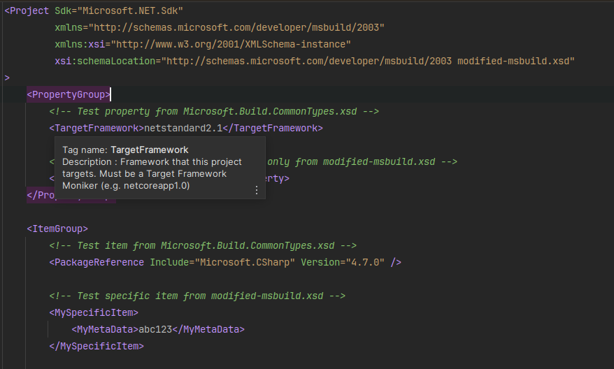
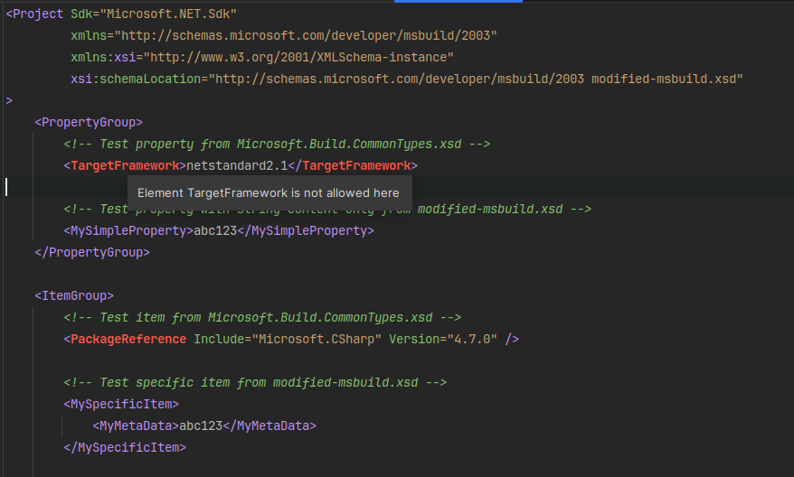
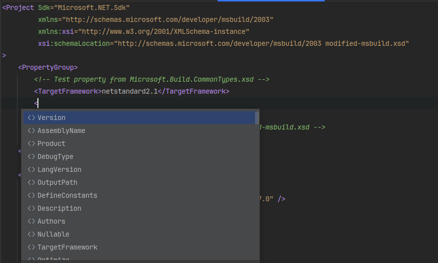
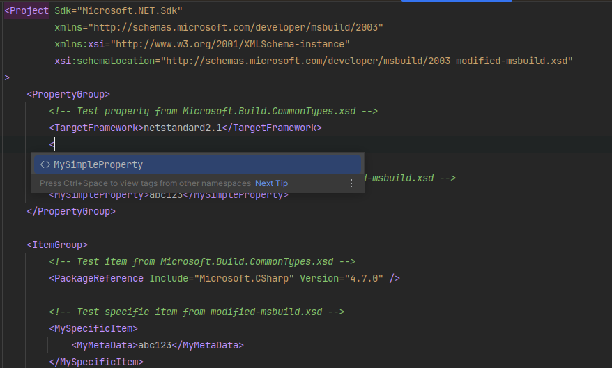

# IntelliJ Platform XML Schema `xs:includes` Bug Reproduction

## Brief description

IntelliSense and XML schema validation malfunction depending on how an XML schema URI is mapped to a resource.
Local file XML schema URIs function correctly (see `Working` directory) and mapped XML schema URIs malfunction
(see `Problem` directory).

## Reproduction steps

1. Clone the repository and open its root in an IntelliJ platform IDE (preferably Rider, as it bundles the MSBuild
   XML schema)
2. Open the file `Working/modified-msbuild.xsd`. Take note that the referenced schema location on line 8
   is a locally available filepath. 
3. Open the file `Working/instance.xml`. Ensure syntax highlighting is enabled. Take note that the IDE reports
   there are no problems with the file's structure, and IntelliSense provides suggestions for all
   the elements present in the file.
4. Repeat step 3 for the file `Working/instance.csproj`.
5. Open the file `Problem/modified-msbuild.xsd`. Place the carat onto line 8 within the `schemaLocation` URI.
6. Open the quick actions context menu (`Alt` + `Enter` on JetBrains keyboard layout) and select `Manually set up external resource`
7. Ensure the selected schema is appropriate - with Rider, the filepath should end with `product.jar!/schemas/msbuild/Microsoft.Build.Commontypes.xsd`
   representing the bundled schema. 
8. Open the file `Problem/instance.xml`. Ensure syntax highlighting is enabled. Take note that the IDE reports
   there are problems within the file's structure, and IntelliSense only provides suggestions for top-level elements and 
   elements defined in `modified-msbuild.xsd`.
9. Open the file `Problem/instance.csproj`. Take note that the IDE reports no problems within the file's structure
   (as `.csproj` files seem to be exempt from schema validation), but that IntelliSense suggestions are similarly 
   malfunctioning. 

## Image Comparisons

### Validation

Validation working:

Validation malfunctioning:

### IntelliSense

IntelliSense working:

IntelliSense malfunctioning:

## What Happened?

IntelliSense and schema validation malfunctioned when the transitively imported XML schema URI was 
mapped using the IDE's XML Schema resource mapping functionality.

## Expected outcome

IntelliSense and schema validation should function correctly (similar to local file URIs) when the 
transitively imported XML schema URI is mapped using the IDE's XML Schema resource mapping functionality.
